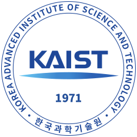

# Education

Focus on 
<ul>
    <li>Machine Learning on Graphs </li>
    <li>Combinatorial Optimization </li>
    <li>High-Performance Computing </li>
</ul>

 

   { width="160" }
  

    <strong style="color:#000000;">RWTH Aachen</strong> 
    Department of Computer Science  
    Master of Science 
    <em>Thesis: A Game-Theoretic Approach for Graph Representation Learning</em> 
    April 2023 - September 2025
  

   { width="160" }
  

    <strong style="color:#000000;">KAIST</strong> 
    School of Computing  
    Stay Abroad 
    March 2025 - July 2025
  

   .svg){ width="160" }
  

    <strong style="color:#000000;">University of Tokyo</strong> 
    School of Engineering  
    Stay Abroad 
    October 2023 - February 2024
  

   { width="160" }
  

    <strong style="color:#000000;">RWTH Aachen</strong> 
    Department of Computer Science  
    Bachelor of Science 
    <em>Thesis: Benchmark Evaluation of Stacked Ensemble Learners    with Estimation Statistics in the Context of
Intrusion Detection </em> 
    October 2019 - March 2023
  

